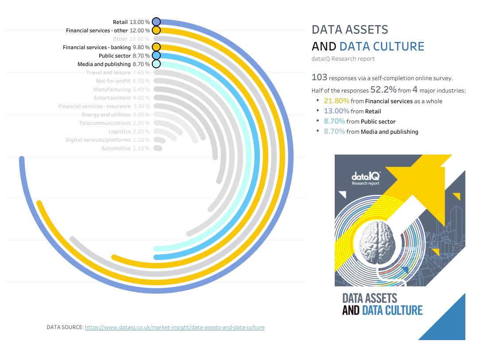

# @makeovermonday
Improving data visualizations one chart at a time.

| YearWeek | Data | Tableau |
|-|-|-|
| 2020W44 | The digital gender gap | |
| 2020W43 | Apparel exports to the US | |
| 2020W42 | Health spending | |
| 2020W41 | [Data assets and data culture](https://data.world/makeovermonday/2020w41-data-assets-and-data-culture/workspace/project-summary) ||